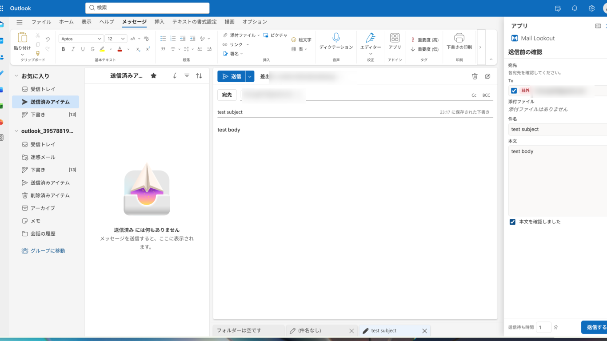
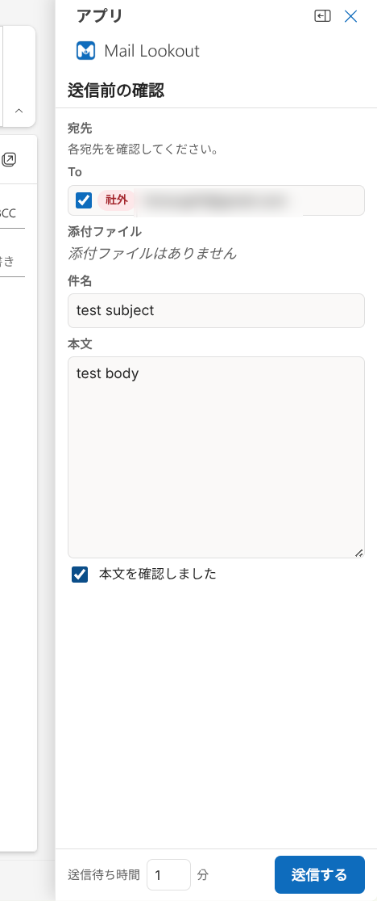
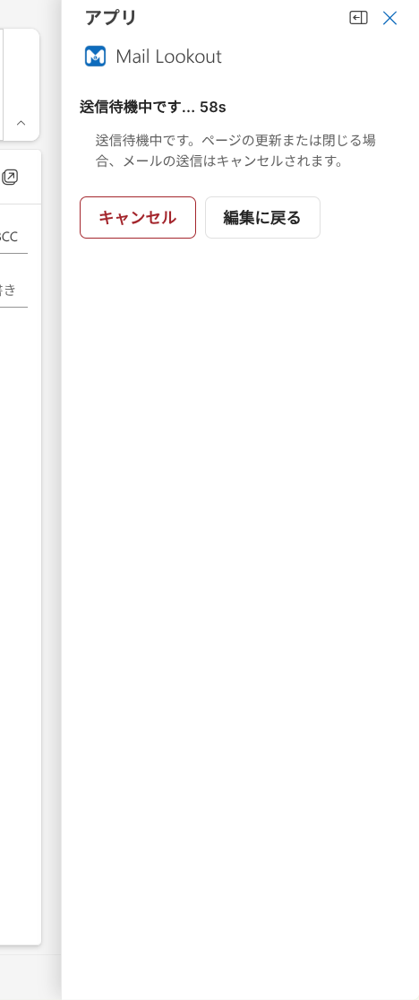
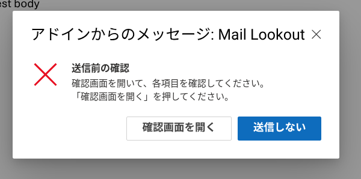

<!-- i18n: language-switcher -->
[English](README.md) | [日本語](README.ja.md)

# Mail Lookout

A send-confirmation add-in for new Outlook and Outlook on the web.

It runs when you press Send. Outlook's built-in Smart Alerts dialog
opens a review task pane with checkboxes for recipients, attachments,
subject, and body. After everything is checked, the review pane sends
the message. The goal is to stop the small mistakes: the wrong
recipient, the forgotten attachment, the empty subject.

**Scheduled send / Send later is not supported.** When Outlook has a
future delivery time on the draft, Mail Lookout skips its review flow
and lets Outlook schedule the message unchanged. Scheduled messages
are therefore not checked by this add-in.

The name is literal: a lookout for your outgoing mail — a quiet watch
that flags problems before a message leaves.

> Japanese version: [README.ja.md](./README.ja.md)

## Features

This add-in does four things at send time.

1. **Recipient check.** It lists every recipient by field (To, Cc,
   Bcc) and marks external ones.
2. **Attachment check.** It lists every real attachment.
3. **Body check.** It shows a preview of the body and asks you to
   review it.
4. **Review pane confirmation.** It blocks the first send attempt
   and opens a task pane where required items must be checked.

It also raises two warnings:

- **Empty subject.** Requires an explicit check when the subject is blank.
- **Forgotten attachment.** A warning when the body mentions an
  attachment ("see attached", "添付") but no file is attached.

A **Settings** task pane lets each user adjust the internal domains
and the default send-delay. Those are stored per user in Outlook
roaming settings, so they follow the user across devices. Everything
else — and the shipped defaults — lives in one config file,
[`src/config/defaults.ts`](./src/config/defaults.ts).

## Screenshots

On Send, Outlook's Smart Alerts opens the review pane; once the checklist
is confirmed, a cancellable countdown sends the message.

The review pane in Outlook on the web:



Up close — the review checklist and the send-wait countdown:

<p>
  
  
</p>

The built-in Smart Alerts message that opens the review:



## Requirements

- New Outlook on Windows, or Outlook on the web.
- Mailbox requirement set 1.15 or later.
- Bun 1.3 or later for development.

This add-in does **not** run on Outlook mobile. See the limitations
section for classic Outlook on Windows.

## Architecture

The code is split so the logic does not depend on Office.

```
src/
  domain/    Pure logic. No Office, no DOM, no time. Fully tested.
  config/    The config shape and its defaults.
  i18n/      Type-safe messages. One file per language.
  shared/    Shared message shapes used by the browser-only preview.
  office/    The Office adapter. Reads the draft, runs the Smart Alerts handler.
  commands/  Registers the send handler with Office.
  dialog/    Renders the browser-only confirmation preview.
```

The `domain` layer is the core. It takes a plain snapshot of the
message plus the config, and it returns a flat, JSON-serializable
model. It decides what to show and what to require. Because it
touches nothing from the host, every rule is tested with plain
data. The tests are where the value is.

The `office` layer is a thin adapter. It reads the draft through
the Office APIs, hands a plain snapshot to `domain`, and then uses
Outlook's built-in Smart Alerts dialog to cancel or allow the send.
The core layers import nothing from Office, so the boundary holds by
construction; keep any new host calls in the `office` layer.

## Setup

```sh
# 1. Install dependencies.
bun install

# 2. Trust a local HTTPS certificate. Outlook requires HTTPS.
bun run dev-certs

# 3. Start the dev server on https://localhost:3000.
bun run dev:outlook
```

Then sideload `manifest.xml` in Outlook. The steps depend on the
host:

- **Outlook on the web:** open Settings, go to the add-ins page,
  choose "Add a custom add-in" then "Add from file", and pick
  `manifest.xml`.
- **New Outlook on Windows:** use the same add-ins management page,
  reached from Outlook on the web with the same account.

After sideloading, open a new message, fill in a recipient, and
press Send. Outlook's Smart Alerts dialog should appear. Choose
"Open review", check the required items in the task pane, then press
Send again without changing the draft.

### Local emulator without Outlook

You can test the review flow in a browser without Outlook:

```sh
bun install
bun run dev:emulator
```

Or start the normal dev server and open `/emulator.html` on the URL
Vite prints. If port 3000 is busy, Vite will choose the next free
port, for example `https://localhost:3001/emulator.html`. The
emulator uses the same domain logic and dialog renderer as the
Outlook send handler, but it does not load Office.js or call Outlook
APIs. Edit the draft fields, switch scenarios, then click "Review
send" to rebuild the dialog.

For Outlook sideloading, use `bun run dev:outlook`. The manifest is
fixed to `https://localhost:3000`, so that script intentionally fails
if port 3000 is already in use.

## Verify the code

```sh
bun run check
```

This runs, in order: lint (oxlint) and format check (oxfmt), type check
on both tsconfigs, tests with coverage, the production build, and
manifest validation. Each step must pass. Useful single steps:

```sh
bun run typecheck      # tsc on src and on the build config
bun run lint           # oxlint
bun run format         # oxfmt --write
bun run test           # vitest, run once
bun run test:coverage  # vitest with coverage on the pure layers
bun run build          # tsc --noEmit then vite build
bun run validate       # office-addin-manifest validate
```

## Production deployment

For the public preview, deploy this repository to Cloudflare Pages.
The repository includes `wrangler.toml`, so Pages can build with
`bun run build` and publish `dist/`. During that build,
`scripts/generate-manifest.js` writes `dist/manifest.xml` with
`https://avishaikofun.com` embedded.

The current public preview is served at
[`https://avishaikofun.com/`](https://avishaikofun.com/).
Use `/manifest.xml` from that site when sideloading the add-in.

Tagged releases also attach `mail-lookout-manifest.xml` on the
GitHub Releases page. Use that file when you want a fixed version
instead of the latest hosted manifest.

To bump the patch version, commit it, push the branch, and push the
release tag for GitHub Releases:

```sh
bun run version:patch
```

Use `bun run version:minor`, `bun run version:major`, or `bun run
version:set 1.2.3` for other version changes. These commands update
`package.json` and `manifest.xml`, create the
version commit, push the current branch, then create and push the
`v*` release tag. GitHub Actions creates the release asset from that
tag. The script shows the next version first and asks for a `y/N`
confirmation before changing files. Use `bun run version:bump patch`
when you only want the local version commit without pushing or tagging.

See [CLOUDFLARE.md](./CLOUDFLARE.md) for the step-by-step flow.
`NETLIFY.md` remains as an alternate deploy path.

The source manifest still ships with placeholder values. Replace
them before a production or marketplace release.

1. **GUID.** Replace the `<Id>` in `manifest.xml` with your own
   GUID.
2. **URLs.** Cloudflare Pages is configured for
   `https://avishaikofun.com`. For another host, replace every
   `https://localhost:3000` in `manifest.xml` with your host or run
   `ADDIN_HOST_URL=https://your-domain.example bun run build`. Serve
   the `dist/` folder over HTTPS at that host. The entry JS keeps a
   stable name (`/assets/commands.js`), so the manifest URLs do not
   change between builds.
3. **Internal domains.** Edit `internalDomains` in
   `src/config/defaults.ts`. The shipped default is
   `avishaikofun.com`. If this list is wrong, every recipient looks
   external.
4. **Metadata.** Replace `ProviderName`, `SupportUrl`, and
   `AppDomains` in `manifest.xml`.

Then publish through the Microsoft 365 admin center for your
organization, or sideload for a single user.

For a broader public release where users can install the add-in from
Outlook itself, plan on a Microsoft Marketplace / AppSource
submission after the hosted preview is stable.

For the current Marketplace description, certification notes, and
resubmission checklist, see
[`docs/marketplace-resubmission.md`](./docs/marketplace-resubmission.md).

## Configuration

The shipped defaults live in
[`src/config/defaults.ts`](./src/config/defaults.ts) — fork that file
to change them. At runtime, the Settings task pane overrides the
internal domains and the default send-delay per user. The main options:

- `internalDomains`: domains treated as internal (also editable in the
  Settings pane).
- `sendDelaySeconds`: the default countdown before a confirmed message
  is sent (also editable in the Settings pane).
- `requireRecipientConfirmation`: include recipients in the
  send-time confirmation.
- `requireAttachmentConfirmation`: include attachments in the
  send-time confirmation.
- `requireBodyConfirmation`: include the body preview in the
  send-time confirmation.
- `attachmentKeywords`: words that hint the body refers to an
  attachment, used by the forgotten-attachment warning.
- `warnOnEmptySubject`: warn when the subject is blank.
- `fallbackLocale`: language used when the host language is
  unknown.
- `dialog`: dialog width and height as a percent of the screen.

## Add a language

The messages are type-safe. To add a language:

1. Copy `src/i18n/locales/en.ts` to a new file, for example
   `de.ts`, and translate every value.
2. Add one line to `src/i18n/catalog.ts`: import it and add it to
   the `locales` object.

The compiler will tell you if you miss a key. A test in
`test/i18n.test.ts` also checks that every locale has the same set
of keys. Nothing else needs to change. The locale tag type updates
itself from the keys of `locales`.

## SendMode

The manifest uses `SendMode="SoftBlock"`. When the add-in cancels a
send, the user must go back and edit the draft. There is no one-click
"send anyway" path. This is on purpose: a confirmation tool whose
every cancel is one click to bypass does not confirm much.

The first send attempt shows the Smart Alerts dialog and cancels the
send. The dialog's action button opens a task pane with the checkbox
review UI. After the task pane marks the draft as reviewed, it sends
the message through Outlook's compose API. If any unexpected error
happens, the handler cancels the send. It never sends real mail without
confirmation.

## Limitations

Be honest about what this is and is not.

- **Custom Office dialogs can't be opened from the send event.**
  `OnMessageSend` runs through event-based activation, and Office UI
  APIs such as `Office.context.ui.displayDialogAsync` are blocked
  there. The production send flow therefore uses the built-in Smart
  Alerts dialog instead of the browser preview dialog.
- **The send delay runs in the review pane.** Outlook's Smart Alerts
  handler must stay short-running, so the task pane owns the countdown
  and then calls Outlook's compose send API. Closing or refreshing the
  pane cancels that pending send.
- **Scheduled send / Send later is intentionally bypassed.** Mail
  Lookout checks `delayDeliveryTime` at send time. If a future delivery
  time is set, the add-in allows the event immediately and doesn't open
  the review pane. This avoids converting a scheduled message into an
  immediate `sendAsync` send, but it also means Mail Lookout does not
  protect scheduled messages.
- **Classic Outlook on Windows is not a target.** That host uses a
  JavaScript-only runtime for send handlers. This project builds an
  ES module that loads through an HTML page in a browser runtime,
  which is what new Outlook and Outlook on the web use. The
  manifest declares a JS-only override for schema reasons, but the
  classic path is not supported or tested.
- **Outlook mobile is not supported.** Smart Alerts on send do not
  run there.

## Disclaimer

Use this add-in at your own risk. The authors and contributors are
not responsible for any damages, losses, misdelivery, business
interruption, or other liability arising from the use of, inability
to use, deployment of, or modification of this software. Review the
configuration and behavior before using it in a production
environment.

### Relation to OutlookOkan

[OutlookOkan](https://github.com/t-miyake/OutlookOkan) is an existing
send-confirmation tool for Outlook. Mail Lookout respects the work
and the problem it addresses.

Mail Lookout is an independent project. It is not affiliated with,
endorsed by, or sponsored by OutlookOkan or its author.

## Migrating to the unified manifest

This project ships an add-in only manifest (`manifest.xml`), which
is well supported on Outlook on the web and new Outlook today. The
unified manifest for Microsoft 365 is the newer format and is the
direction Microsoft is moving. If you need it, the
`office-addin-manifest` tool can convert an XML manifest to the
unified format. The runtime code in this project does not change;
only the manifest does.

## License

0BSD. You can use, copy, modify, and distribute this project for almost any purpose.


[MIT](./LICENSE)
